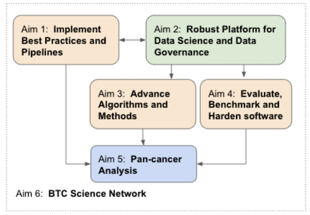

## DASH Overview
Welcome to DASH, the **DA**ta **S**cience **H**ub portal in Break *Through* Cancer (BTC).
DASH is meant to be a central reference for data science across the BTC network, providing
an easy-to-remember, one-stop access point for computational methods, analysis piplines,
and data; as well as information on the aims and composition of the Data Science TeamLab
(DST), how we will work in concert with the disease
TeamLabs across BTC, and comprehensive standards and documention on data generation and
infrastructure.  Each facet of DASH is evolving very rapidly, so please come back regularly!

## BTC Data Science in Brief
The primary goal of the Data Science TeamLab (DST) in BTC is to unify BTC investigators around data and
computation, into a collaborative network that will enhance and accelerate all disease research and
discovery objectives.

By providing essential data infrastructure and advanced computational cancer biology, in support of the scientific 
objectives and the experimentalist and clinical team members of BTC projects, we aim to increase the efficiency, 
durability and robustness of all BTC research. 
By making a dedicated investment in the development of new computational methods and software, we aspire to advance 
biological questions and themes cutting across all BTC disease teams, including 

1. cancer evolution & cellular plasticity
2.  spatial determinants of microenvironments and 
3. tumor cell immune cell interactions

Moreover, in the collaborative spirit of BTC, our network-wide model also provides a unique social component 
dedicated to mentoring the next generation of outstanding investigators.  The data science initiative within BTC
thus constitutes a unique and transformative multi-institutional initiative that will

- be continuously responsive to the scientific needs of diease projects and investigators
- practice rigorous and secure data engineering, informed by [F.A.I.R. principles](https://www.go-fair.org/fair-principles/)
- accelerate advances in computational methods required to achieve BTC scientific aims
- create robust, benchmarked and hardened software for scaled, systematic deployment
- maximize the impact of each BTC project by enabling and accelerating pan-cancer analysis;
- create a collaborative network of data science investigators and trainees to power these objectives

For more details, please see the
<a target=_blank href="https://breakthroughcancer.sharepoint.com/:b:/r/sites/TeamLab-BreakThroughCancerInformation/Shared%20Documents/DataScience/Governance/Data_Science_Hub_Proposal.pdf?csf=1&web=1&e=tPU3lK">full data science proposal here.</a>

## How We'll Work Together

As noted in 
<a target=_blank href="https://breakthroughcancer.sharepoint.com/:p:/r/sites/TeamLab-BreakThroughCancerInformation/Shared%20Documents/DataScience/Governance/2022-10-12_BTC_DataScienceHub_Kickoff-Excerpt.pptx?d=w01a7224e5a4b49959408b653b5b865c4&csf=1&web=1&e=W4oIIe">
these slides excerpted from our kickoff (12-Oct-2022)</a>, the Data Science TeamLab sees itself as

* Facilitators of disease TeamLab science
* Innovators of high-resolution, multi-modal analytic methods
* Weavers of infrastructural fabric linking these together

thereby breaking through traditional research silos to foster the widest, deepest, and fastest cross-institutional engagement of BTC expertise, within a secure and well-governed platform.  We hope to achieve this through dynamic and transparent collaboration with each disease team, to learn where we may help each other, how, and at what cadence.  This may often take the form of data scientists helping to answer a myriad of scientific questions posed by the disease group, co-analyzing data, and using the resulting insights to drive the development of new computational methods.  At other moments it might be engineers co-developing a database model, or forms for gathering clinical parameters, or assisting with data upload to cloud storage and automated analysis.  At still other points, it might involve co-developing pipeline methods or exploratory visualizations and dashboarding tools, or guiding others in their use.

The work will play out in a variety of ways, but this is just the beginning of a transformative experiment in multi-institutional, collaborative science; we know our collective efforts will lead to opportunities and challenges not yet envisioned, but look forward to working with disease teams to identify and prioritize areas of greatest unmet scientific, algorithmic, or technical need and cultivating solutions that accelerate our science.

## Primary Contacts

We are fortunate to have the talents of [Benjamin Greenbaum](mailto:greenbab@mskcc.org) and [Kadir Akdemir](mailto:kcakedemir@mdanderson.org) to coordinate our monthly meeting series and related activity, so for general matters please reach out to them.   For administrative questions, please contact Ineke Ceder, and for our proposal aims the primary contacts are as follows:

* **Aim 1 - Best Practices Pipelines:** [Rameen Beroukhim](mailto:rameen@broadinstitute.org), [Linghua Wang](mailto:lwang22@mdanderson.org)

* **Aim 2 – Data Infrastructure and Governance:**  [Michael Noble](mailto:msn@breakthroughcancer.org)

* **Aim 3 - Algorithms and Methods:** [Sohrab Shah](mailto:shahs3@mskcc.org)

* **Aim 4 - Evaluate/Benchmark/Harden Software:** [Andrew McPherson](mailto:), [Charlie Whitaker](mailto:charliew@mit.edu)

* **Aim 5 - Pan-cancer Analysis:** [Linghua Wang](mailto:lwang22@mdanderson.org), [Rameen Beroukhim](mailto:rameen@broadinstitute.org)

* **Aim 6 - BTC Data Science Network:** [Kadir Akdemir](mailto:kcakedemir@mdanderson.org), [Elana Fertig](mailto:ejfertig@jhmi.edu)

## Data Infrastructure

BTC is unique in the foresight and boldness of its commitment to placing collaborative data science at the center of a diverse research portfolio.  But realizing that long-term vision will not be easy or quick, so it is worth emphasizing that early versions of infrastructure and tools will be enabling but minimalist; and, like all early-stage work, will look and feel more like exposed foundation and scaffolding.  With each successive iteration, however, we will identify what critical needs remain unmet and what features to keep or eliminate, while emphasizing clarity, transparency, and simplicity.  Here is a summary of recent thought progress on infrastructure and how that informs planning at several scales.  Regular updates will be given to all of BTC as these efforts mature, and detailed plans will be circulated as they emerge.

### Early, Medium, and Long-Term Planning

**In the nearest term** and as a stopgap measure while hiring staff, finalizing partner SOWs, and gradually assembling infrastructure, we’ve constructed a prototype data lake using the Google Cloud Platform (GCP).  While just the first step towards our long-term vision, this reflects our 
*patient über alles*
sense of urgency that to best support ongoing BTC science
*data must flow*.
The data lake will provide a central point of aggregation and access, and facilitate immediate sharing within TeamLabs because it does not require extensive build-out nor deep modeling, validation or annotation. We are working closely with clinical data coordinators and thought leaders across BTC to identify SOPs, data and annotations of greatest immediate impact, while prototyping lightweight mechanisms for submission of molecular and clinical data.  As these data accumulate, we will also host a BTC-wide dashboard to foster transparency on accrual.

**In the medium term** and drawing from substantial discussion and technical review with stakeholders and technology partners, we will further improve data flow through a pilot with Sage Bionetworks.  Guided by a core philosophy of reuse rather than reinvent, using Synapse to validate ingestion will endow our data store with provenance and provable correctness; directly leverage the GCP data lake; stimulate rapid progress by reusing existing standards and open-source components developed in sister projects like HTAN; and reduce development time and cost.  As that matures, we’ll begin to assemble and operationalize a standard analysis workflow, which can either make direct use of the data lake or Synapse warehouse.  Early versions of the analysis workflow will focus on tools already seeing wide use in the community 
(e.g. [NextFlow Core](https://nf-co.re)) and/or 
[pre-installed in Terra](https://broadinstitute.github.io/warp/docs/get-started/);
but as new methods develop across BTC and beyond we’ll seek to harden them for scale and incorporate into the standard analysis as well.

**For the long term,** and given the complexity and rapid evolution of technology and science in cancer research, we recognize that no single platform addresses our entire slate of data collection, governance, and analysis needs.  We will therefore continue to engage a wide range of technology partners—including Verily/Google, Microsoft, Code Ocean, Syntropy, Flywheel, and Seven Bridges; towards defining proof-of-concept pilots to discern areas of mutual collaborative interest and potential philanthropic opportunity, while reaching for continuous improvement of the scientific and clinical capability, governance, reproducibility, scalability, security, and robustness of our system.
