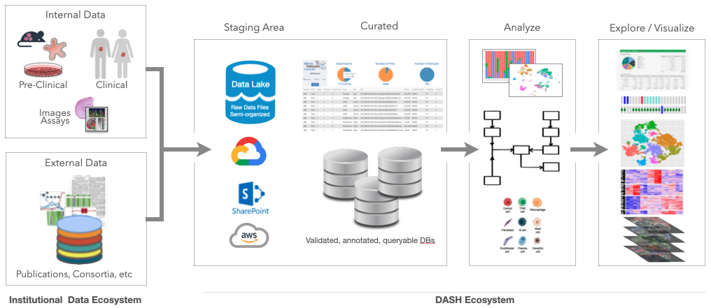
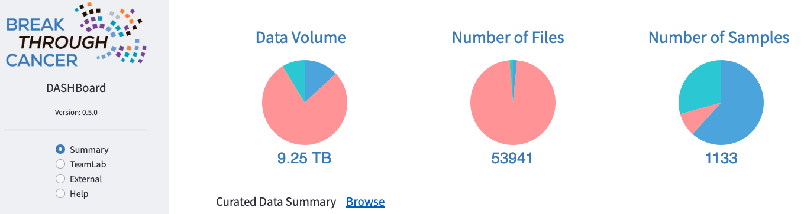
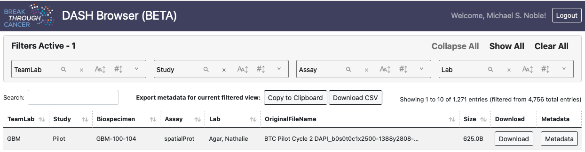
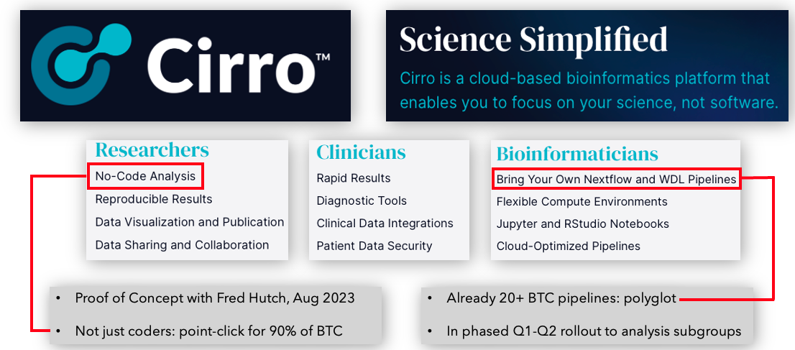
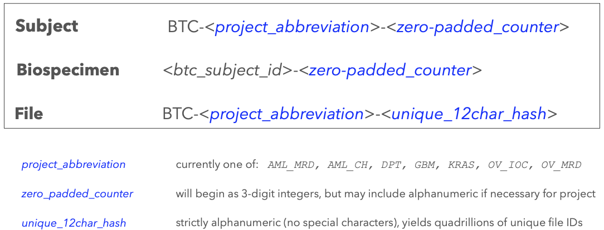
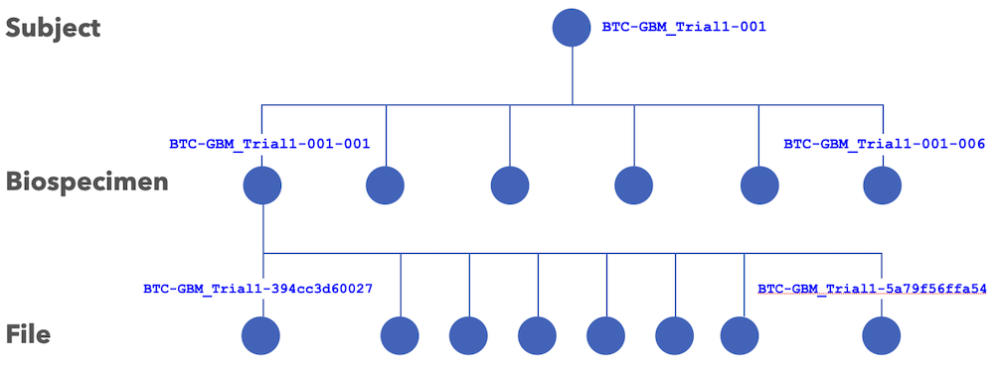
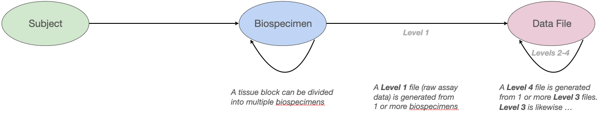
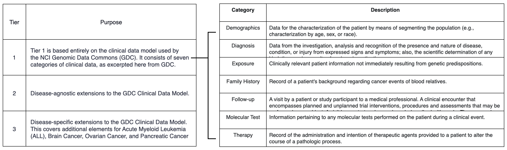

## BTC Data Reference
The aim of this document is to serve as a central point of reference for data handling in Break Through Cancer (BTC), capturing the consensus rubric under which data are generated, annotated, aggregated, governed, and accessed.  This includes metadata capture during patient enrollment and sample acquisition, standards and processes for molecular assay data generation and pipelines, data flow diagrams providing simplified views, as well as a FAQ for common questions.  In concert with BTC Disease TeamLabs, these
norms are being codified by the Data Science TeamLab (DST) as a key element of the
<a target=_blank href="https://breakthroughcancer-my.sharepoint.com/:b:/g/personal/msn_breakthroughcancer_org/EV7qf7tHVRpMoFaCgpI_owwBAzJ-BsvEBHjkVcEr74WSRw?e=lc2A8r">data science proposal</a>

The system and infrastructure which serves as the convergence point for data science activity within BTC is
code-named **DASH**, short for **DA**ta **S**cience **H**ub; and is informed by numerous standards,
including [F.A.I.R. data practice](https://www.go-fair.org/fair-principles/) and
<a target=_blank href="https://sharing.nih.gov/data-management-and-sharing-policy/sharing-scientific-data/selecting-a-data-repository">
NIH guidelines</a>
, and draws heavily from lessons learned and software developed in earlier and sister projects, including
[HTAN](https://data.humantumoratlas.org),
<a target=_blank href="https://gdc.cancer.gov">GDC</a>, and
<a target=_blank href="http://cancergenome.nih.gov">TCGA</a>

## Data Life Cycle
---

This will be described in more detail below, but first note that within BTC the flow of data naturally subdivides along the boundaries of institutional and BTC-wide ecosystems:

*   **Institutional:**  data, research, and clinical trial activity typically within the walls of a single instution, performed upon and annotated by institutional systems per their internal practice
*   **DASH:**  data shared by TeamLabs across institutional boundaries, by way of **DASH**

## Planning for Data Sharing
---
Please contact the BTC Programs Team when planning to share data used by or generated in your TeamLab, whether pre-clinical, clinical, or publication data.  The PM team will help assess whether there are contractual, institutional, or other
encumbrances upon the data that must be cleared first before they may be shared.  While planning it's also important to note that:

* ***Sharing non-public data via DASH does not confer access to other TeamLabs:*** such data are initially embargoed,
with access limited to members of the submitting TeamLab until the embargo period ends
* Patient IDs, sample IDs, and related metadata are defined within clinical lab manuals and SOPs: this will help BTC maintain the provenance of material and data as it travels from one institute to another
* SOPs are in place to remove PHI prior to sharing

## Submitting Data
---
When data have been generated and are ready to be shared, please contact the
[the DASH team](mailto:dash@breakthroughcancer.org).  We'll be happy to guide data providers through the
<a target="#" href="https://breakthroughcancer.sharepoint.com/:b:/r/sites/TeamLab-BreakThroughCancerInformation/Shared%20Documents/DataScience/DASH-DataSubmission-Technical-Instructions.pdf?csf=1&web=1&e=dzPNjr">technical instructions for sharing</a>
and help decide which staging method to use (SharePoint or cloud buckets).  The
***staging area*** is a <a target=_blank href="https://en.wikipedia.org/wiki/Data_lake">data lake</a>-style
abstraction: a semi-organized collection of storage bins, stratified by TeamLab, whose contents are provided
"as is," with little (or no) formal validation or annotation.  TeamLab members may elect to use such staged data
immediately, prior to further curation, as needs dictate.

## Data Curation
---

After staging, many (but not necessarily all) BTC datasets will also be curated, which includes steps such as: validating that
submitted files do not include PHI, verifying that trial-specific IDs (when applicable) have been associated so that
the data may be tracked, and ensuring sufficient metadata have been submitted so that others may productively use the data.
BTC-specific IDs will also be assigned within the DASH database to maintain provenance and promote data governance (such as
sandboxed use during embargo periods). These IDs supplement, rather than replace, institutional or trial-specific IDs,
and the mapping between the two will be retained internally by DASH.

## Accessing Data
---
Both staged and curated data are summarized in our
<a target="_blank" href="https://board.breakthroughcancer.org">high-level DASHBoard</a>

and may be downloaded interactively from the
<a target="_blank" href="https://data.breakthroughcancer.org">data browser</a> 

or programmatically via
<a href="https://cloud.google.com/sdk/gcloud/reference/storage">gcloud</a> or
<a href="https://cloud.google.com/storage/docs/gsutil">gsutil</a> for many, large files or pipelined analysis.
Additional information is available in the
<a target="#" href="https://breakthroughcancer.sharepoint.com/:b:/r/sites/TeamLab-BreakThroughCancerInformation/Shared%20Documents/DataScience/DASH-DataSubmission-Technical-Instructions.pdf?csf=1&web=1&e=dzPNjr">technical instructions for data sharing</a>. Finally, recall that staged data are offered "as is," while curated data will soon support more advanced use cases such as querying with 
fine-grained parameters (e.g. gene name) or visual exploration in familiar tools like
<a target=_blank href="https://www.cbioportal.org">cBioPortal</a>,
<a target=_blank href="https://cellxgene.cziscience.com">cellxgene</a>, or
<a target=_blank href="https://www.cycif.org/software/minerva">Minerva</a> as appropriate.

## Analysis and Pipelines
---

The DST has established joint
<a target=_blank href="https://breakthroughcancer.sharepoint.com/:x:/s/BreakThroughCancerStaff/Ef9cmbzRyaZIo82GR-siTPUBmjd2x9lE-nKo3MbCbpqH_g?e=sptYZs">Protocol and Analysis working groups</a> with disease teams, to: identify analysis needs across TeamLabs,
align common SOPs for data generation and QC, coordinate changes as new technologies and needs arise, tie each central analytic
pipeline to consumers of its data in each TeamLab, and perform regular check-ins to ensure analytic approaches continue to 
suit disease TeamLab objectives.

For each data type generated across two or more TeamLabs, the DST will provide best-practices pipelines and/or
tools for each [data level](#omic-data-levels): from Levels 1 and 2 primary data generation (L1, L2) through
subsequent L3 and L4 analyses.  This work is very active, and a number of analysis pipelines are already available
from [DFCI](https://broadinstitute.github.io/warp/docs/get-started/), JHU, MDAnderson, [NextFlow nf-core](https://nf-co.re)
and the [MIT BioMicroCenter](https://openwetware.org/wiki/BioMicroCenter).

As these and other pipelines harden into robust, self-service tools they are also being added to a common analysis workflow
under construction in [Cirro](https://cirro.bio/).

The Cirro platform runs NextFlow and WDL pipelines, and provides powerful tools for computationalists in a modern,
easy-to-use interface that is also approachable for non-computationalists.  The DST has already installed approximately
20 pipeline configurations into Cirro, and is conducting targeted data analysis with the expectation to make an MVP
version broadly available to BTC in Q2 of 2024.  Please contact the [DASH team](mailto:dash@breakthroughcancer.org) if you would like to contribute pipelines, perform analyses, or would simply like more information.

## BTC Identifier Scheme
---

As data are added to DASH they will be tagged with subject and sample (biospecimen) identifiers as follows:

At minimum such IDs will be attached to BTC trial data; ideally to BTC pre-clinicial data as well, and potentially to external data as appropriate. Note that here “biospecimen” is preferred over “sample” for generality and to capture that samples can be subdivided into multiple portions. The association between data file and biospecimen is maintained as
metadata within the DASH database, not within the file identifier itself.  A hypothetical data tree for the first
subject (patient) of the BTC glioblastoma multiforme trial might look like

Here 6 needle biopsy cores (samples) were extracted; the first of which has been characterized in multiple assays, yielding 8 distinctly molecular data output files (i.e. one per data type). Each interventional timepoint in a longitudinal trial would yield a new sample (or samples) for that subject.

## Data Entities and Levels
---

As data progress through the BTC life cycle they are processed and transformed through a series of “data levels.” For each data context (e.g. clinical, imaging, sequencing, spatial) the constituent files of each data level may differ, but in all cases Level 1 represents raw or uncurated data (e.g. directly from an instrument) and each successive level represents a maturation of that data towards analysis and, eventually, publication and wider utilization.

Unless explicitly stated otherwise, we propose BTC data infrastructure, processing and analysis adopt existing GDC + HTAN
standards and nomenclature, including for
[clinical](https://humantumoratlas.org/standard/clinical),
[biospecimen](https://humantumoratlas.org/standard/biospecimen),
[sequencing](https://humantumoratlas.org/standard/sequencing)
and [imaging](https://humantumoratlas.org/standard/imaging) data.
For convenience, some of those standards will be excerpted below but we refer the reader back to the original material at the given links for an exhaustive treatment.

Each disease project in BTC contributes data from 1 or more enrolled Subjects, who have donated Biospecimens. Data files are generated when 
biospecimens are assayed by an instrument/protocol or processed in downstream SOPs or analyses. Captured metadata enables tracing of any data file back to its source biospecimen. Level 1 raw data files are derived directly from the corresponding biospecimen, whereas processed level 2-4 data files are linked to lower level parent data files.

## Clinical Data Levels (Tiers)
---
The BTC clinical data model consists of three tiers. Tier 1 aligns with 
<a target=_blank href="https://gdc.cancer.gov">Genomic Data Commons (GDC)</a> guidelines for clinical data, 
while Tiers 2 and 3 are informed by the [HTAN extensions to the GDC model](https://data.humantumoratlas.org/standard/clinical).

Clinical data in BTC are still evolving as we develop trial forms and SOPs across institutions.  Only Tier1 is encompassed thus far, but ***no data will be ingested into DASH if it is not (a) fully de-identified and (b) accompanied by minimally viable metadata (biospecimen and/or clinical).***

## Omic Data Levels
---
In alignment with TCGA and the NCI Genomic Data Commons, BTC will categorize multi-omic data into four levels:

<table>
  <tr>
    <th>Level</th><th>Definition</th><th>Examples</th>
  </tr>
  <tr>
    <td>1</td><td>Raw data</td><td>FASTQs, unaligned BAMs</td>
  </tr>
  <tr>
    <td>2</td><td>Aligned primary data</td><td>Aligned BAMs</td>
  </tr>
  <tr>
    <td>3</td><td>Derived biomolecular data</td><td>Gene expression matrix files, VCFs, etc</td>
  </tr>
  <tr>
    <td>4</td><td>Sample level summary data</td><td>t-SNE plot coordinates, etc</td>
  </tr>
</table>

These will apply to the 
<a target=_blank href="https://breakthroughcancer.sharepoint.com/:x:/s/BreakThroughCancerStaff/Ef9cmbzRyaZIo82GR-siTPUBmjd2x9lE-nKo3MbCbpqH_g?e=sptYZs"> multiple assay and sequencing modalities (omic data types) envisioned for BTC</a>,
including single-cell and single-nucleus RNA Seq (sc/snRNASeq), single-cell ATAC Seq, bulk RNAseq and Bulk DNAseq.

We propose that BTC follow the latest GENCODE version for gene annotations, GENCODE Version 43.  GENCODE is used for gene definitions by many consortia, including ENCODE, NCI Genomic Data Commons, Human Cell Atlas, and PCAWG (Pan-Cancer Analysis of Whole Genomes). Ensembl gene content is essentially identical to that of GENCODE (FAQ) and interconversion is possible.

We further propose BTC adopt GENCODE 43 Gene Transfer Format (GTF) basic gene annotation file (GENCODE 43 GTF) and filtered files (GENCODE 43 GTF with genes only; GENCODE 43 GTF with genes only and retaining only chromosome X copy of pseudoautosomal region) for gene annotation. BTC may also include external data generated with other gene models, as the process of implementing the standard is ongoing. Within BTC metadata files, we propose the reference genome in use be specified in columns/attributes named “Genomic Reference” and “Genomic Reference URL”.

## External Data
---

Data generated through efforts funded by other organizations is referred to as “external data”.  BTC investigators are free 
(and encouraged) to utilize external data in BTC work, which will typically play out in one of two ways:

* **Ad-hoc:**  in which the investigator or their staff downloads external data to local institutional resources (e.g. on-prem compute or cloud) and references in their local BTC analyses; here the investigator and/or staff initiates & performs the collecting, aggregating and storing of external data on their institutional systems

* **DASH:** investigator requests that BTC make external easily accessible to other BTC collaborators via DASH; either in raw form directly from the staging area or more formally with BTC identifiers attached so that the identity and provenance are clear

In the latter case of external data being assigned BTC IDs, a unique project abbreviation will be created to indicate that the dataset is from an external source, following the schema EXT_<dataset_specific_tag>.  For example, if we were to load BRCA data from TCGA into DASH, one might use TCGA_BRCA as the project abbreviation, yielding identifiers for such data that begin with BTC-TCGA_BRCA- and so forth.  Attaching BTC identifiers to external data may provide a number of advantages

* Enabling it to be seamlessly mingled with internal BTC data
* Then processed and analyzed at scale in downstream pipelines or analysis tools
* While making the external identity and provenance of the data clear
* And simplifying later bookkeeping and database tracing when assembling data for publication

but should not be interpreted as a claim that BTC now “owns” or is attempting to “re-brand” those external data.

## Version 0.7.0

