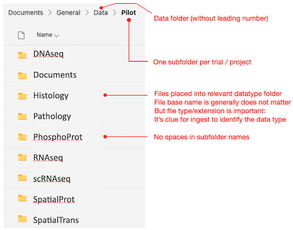
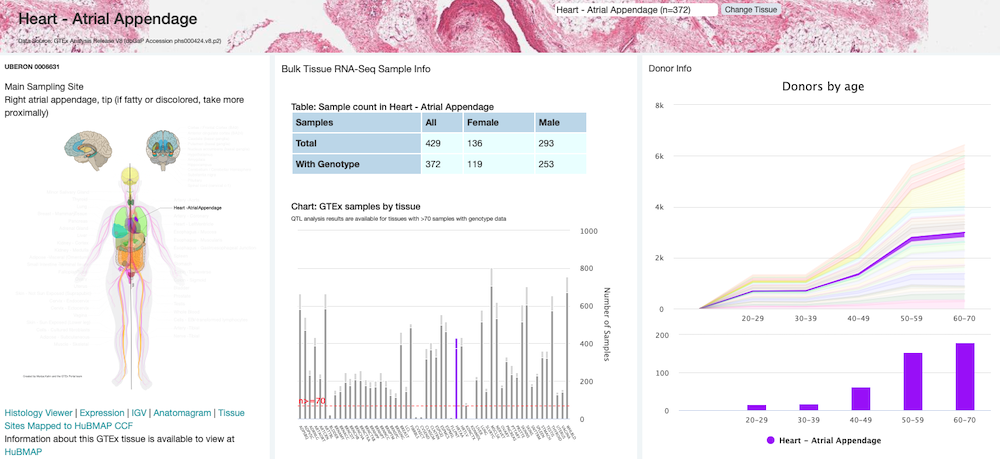

# Introduction

The aim of this document is to serve as the definitive reference for data handling in Break Through Cancer (BTC), establishing the consensus rubric under which data are identified, categorized, generated, aggregated, accessed, and governed.  This includes metadata capture during patient enrollment and sample acquisition, standards and processes for molecular assay data generation and pipelines, data flow diagrams providing simplified views, as well as a FAQ for common questions.
In concert with BTC Disease TeamLabs, these norms are being codified by the [Data Science TeamLab (DST)](https://dash.breakthroughcancer.org) as a key element of the [data science proposal](https://breakthroughcancer-my.sharepoint.com/:b:/g/personal/msn_breakthroughcancer_org/EV7qf7tHVRpMoFaCgpI_owwBAzJ-BsvEBHjkVcEr74WSRw?e=lc2A8r).

The system and infrastructure which serves as the convergence point for data science activity within BTC is
code-named **DASH**, short for **DA**ta **S**cience **H**ub; and is informed by numerous standards,
including [F.A.I.R. data practice](https://www.go-fair.org/fair-principles/) and
[NIH guidelines](https://sharing.nih.gov/data-management-and-sharing-policy/sharing-scientific-data/selecting-a-data-repository),
and draws heavily from lessons learned and software developed in earlier and sister projects, including
[HTAN](https://data.humantumoratlas.org), [GDC](https://gdc.cancer.gov), and [TCGA](http://cancergenome.nih.gov).

## Data Life Cycle
---

The general flow of data within BTC is as follows:

It is helpful to distinguish that the BTC data ecosystem has **2 layers of context:** the first encompasses institutional and especially clinical trial activity, the other encompasses data activity vis-a-vis **DASH** proper.

*   **Layer 1**:  Institutions conduct clinical trials and collect sample data in their own systems, per their current practice. This originating data will have trial-specific IDs & categorizations relevant in the context of that trial or institution. And is where PHI is maintained; ***such PHI will be removed prior to ingest to BTC.***

*   **Layer 2:**  BTC will assign BTC-specific IDs when data are ingested into DASH.  The BTC nomenclature and IDs supplement those of the 
institution and trial, rather than replace.  The mapping between BTC and trial IDs will be retained internally by BTC, and is important provenance to prevent orphaning (see below).

**Note that DASH is still in the early stage of development and this data lifecycle is not fully operational.**
Reflecting the patient-centered BTC sense of urgency, to date more activity has been leftward, working with disease teams to
identify how clinical and research needs translate into SOPs, staging and cloud-based data infrastructure so that *data may flow*.
However, that work directly supports [pipelined analyses](#analysis-and-pipelines) and exploratory visualization capabilites
moving rightward, and we are committed to an iterative, [agile-inspired process](https://agilemanifesto.org) of frequent
data and software releases to further BTC goals.

## Submitting and Tracking
---
Please [contact the DASH team](mailto:dash@breakthroughcancer.org) when your TeamLab is ready to add data to DASH. We'll be happy to
guide the process and help decide which staging method is appropriate, as well as perform initial data validation; this may include
verification with the TeamLab (and/or PI, etc) that the data are indeed eligible and ready for sharing, initial PHI assessment,
verifying that trial-specific IDs (when applicable) have been entered into the
[data submission tracker](https://breakthroughcancer.sharepoint.com/:x:/s/DataScienceHub/EXcr6XK3eTdEienLGINk6WQBxOI0Xdt78GhulUT9gXz-PQ?e=2VTl1d)
and associated with corresponding BTC identifiers, and that sufficient metadata are captured.

In addition to surfacing the inventory of data being readied for inclusion in DASH, the tracker will also indicate through what
phase each dataset has progressed rightward during its life cycle. While the data SOP remains under development and not fully
operational, this process may take a week or more after initial submission; but the tracker will reflect when data are
accessible to the given teamlab via dashboards and available for download through the
[data browser](https://dash.breakthroughcancer.org/data_browser), and (eventually) explorable in familiar tools
like [cBioPortal](https://www.cbioportal.org),
[cellXgene](https://cellxgene.cziscience.com/) or [Minerva](https://www.cycif.org/software/minerva) as appropriate.

###Sharing and Orphaning 

***It is important to note that***

* Submitting data to DASH does not confer access to other TeamLabs in BTC: until the TeamLab collectively decides to provide such data to other TeamLabs, access is limited to members of the submitting TeamLab
* Clinical lab manuals and SOPs outline steps for registering trial-specific subject and sample IDs in DASH, to prevent ***orphaning***:
when the provenance of physical material or data cannot be established because it's been shipped from one institute to 
another either (a) without trial-specific IDs or (b) recording those trial-specific IDs in DASH and assigning corresponding BTC IDs

## Staging Area
---
The staging area is an abstraction that serves as the entryway into DASH: staging of data generated within a disease TeamLab signifies that
it is ready to be freely shared amongst other members of the team.  This can be done in one of two ways:  **first**, to
simplify and expedite immediate data sharing by using existing drag-n-drop infrastructure wherever possible, small images, figures and documents
(including pre-clinical) can be deposited directly to the **Data** folder within the team's respective SharePoint area; **second**, larger data,
such as the molecular results of DNA or scRNA sequencing assays, should be uploaded to data lake cloud storage.  To aid clarity and automation,
we suggest organizing files into consistent subfolder names according to their data type, along the lines of

## Data Lake
---

After staging, data will be migrated to the data lake: a semi-organized area of cloud storage containing the files "as deposited," meaning no
additional processing, subdivision or interpretation has been performed upon the uploaded files--other than stratification by TeamLab, BTC
identifiers, and assay data type.  Cloud storage in the data lake (i.e. [buckets](https://cloud.google.com/storage/docs/buckets)) will be
accessible for systematic analysis in downstream pipelines and tools where the medium of exchange is coarse grained--at the level of entire
files rather than portions of content within the files.  Finer grained access, such as the ability to query individual rows, columns or
data elements within the files (e.g. the expression level of a single gene from a given sample) is typically not performed directly from a
data lake but rather via downstream database queries, dashboards or visual-exploratory interfaces (further right in the data life cycle).

## Warehouse
---

The purpose of the data warehouse is to provide additional validation and cataloging of data within the lake, distilled into high-level 
dashboards and portals queryable by way of a simple, point-click interface.  Due to the ease with which they provide comprehensive summary 
views of data-intensive science, such portals can be an important means of initial engagement with research data.  The BTC warehouse is 
under construction, but many other examples abound, including the
[GDC](https://gdc.cancer.gov) and [HTAN](https://data.humantumoratlas.org); here we show an excerpt from the 
[GTEx portal:](https://www.gtexportal.org/home/tissue/Heart_Atrial_Appendage?tissueSelect=Heart_Atrial_Appendage)

## Analysis and Pipelines
---

The DST is working with disease teams to [compile data and analysis needs cutting across BTC
efforts](https://breakthroughcancer.sharepoint.com/:x:/s/BreakThroughCancerStaff/Ef9cmbzRyaZIo82GR-siTPUBmjd2x9lE-nKo3MbCbpqH_g?e=sptYZs).  For each data type in this list
the DST will provide pipelines and/or tools for each [data level](#omic-data-levels): from Levels 1 and 2 primary
data generation (L1, L2) through subsequent L3 and L4 analyses.  This work is still early but very active, and a
number of analysis pipelines are already available from
[Terra](https://broadinstitute.github.io/warp/docs/get-started/), MDAnderson, [NextFlow nf-core](https://nf-co.re)
and the [MIT BioMicroCenter](https://openwetware.org/wiki/BioMicroCenter).  Please contact the
[DASH team](mailto:dash@breakthroughcancer.org) for more information if you are unsure of how to proceed.
   
## BTC Identifier Scheme

Subject and sample (biospecimen) identifiers will be attached to BTC data as follows:

Here “biospecimen” is preferred over “sample” for generality and to capture that samples can be subdivided into multiple portions. The association 
between data file and biospecimen is maintained as metadata within the DASH database, not within the file identifier itself.  A hypothetical data 
tree for the first subject (patient) of the BTC glioblastoma multiforme trial might look like

Here 6 needle biopsy cores (samples) were extracted; the first of which has been characterized in multiple assays, yielding 8 distinctly molecular data output files (i.e. one per data type). Each interventional timepoint in a longitudinal trial would yield a new sample (or samples) for that subject.

## Data Entities and Levels
---

As data flow in BTC they are processed and transformed, passing through a series of “data levels.” For each data context (e.g. clinical, imaging, sequencing, spatial) the constituent files of each data level may differ, but in all cases Level 1 represents raw or uncurated data (e.g. directly from an instrument) and each successive level represents a maturation of that data towards analysis and, eventually, publication and wider utilization.

Unless explicitly stated otherwise, we propose BTC data infrastructure, processing and analysis adopt existing GDC + HTAN standards and 
nomenclature, including for
[clinical](https://humantumoratlas.org/standard/clinical), 
[biospecimen](https://humantumoratlas.org/standard/biospecimen),
[sequencing](https://humantumoratlas.org/standard/sequencing) 
and [imaging](https://humantumoratlas.org/standard/imaging) data.
For convenience, some of those standards will be excerpted below but we refer the reader back to the original material at the given links for an exhaustive treatment.

Each disease project in BTC contributes data from 1 or more enrolled Subjects, who have donated Biospecimens. Data files are generated when 
biospecimens are assayed by an instrument/protocol or processed in downstream SOPs or analyses. Captured metadata enables tracing of any data file back to its source biospecimen. Level 1 raw data files are derived directly from the corresponding biospecimen, whereas processed level 2-4 data files are linked to lower level parent data files.

## Clinical Data Levels (Tiers)
---
The BTC clinical data model consists of three tiers. Tier 1 aligns with [Genomic Data Commons (GDC)](https://gdc.cancer.gov/) guidelines for clinical data, while Tiers 2 and 3 are informed by the [HTAN extensions to the GDC model](https://data.humantumoratlas.org/standard/clinical).

Clinical data in BTC are still evolving as we develop trial forms and SOPs across institutions.  Only Tier1 is encompassed thus far, but ***no data will be ingested into DASH if it is not (a) fully de-identified and (b) accompanied by minimally viable metadata (biospecimen and/or clinical).***

## Omic Data Levels
---
In alignment with TCGA and the NCI Genomic Data Commons, BTC will categorize multi-omic data into four levels:

<table>
  <tr>
    <th>Level</th><th>Definition</th><th>Examples</th>
  </tr>
  <tr>
    <td>1</td><td>Raw data</td><td>FASTQs, unaligned BAMs</td>
  </tr>
  <tr>
    <td>2</td><td>Aligned primary data</td><td>Aligned BAMs</td>
  </tr>
  <tr>
    <td>3</td><td>Derived biomolecular data</td><td>Gene expression matrix files, VCFs, etc</td>
  </tr>
  <tr>
    <td>4</td><td>Sample level summary data</td><td>t-SNE plot coordinates, etc</td>
  </tr>
</table>

These will apply to the multiple assay and sequencing modalities (omic data types) envisioned for use in BTC
[shown here,](https://breakthroughcancer.sharepoint.com/:x:/s/BreakThroughCancerStaff/Ef9cmbzRyaZIo82GR-siTPUBmjd2x9lE-nKo3MbCbpqH_g?e=sptYZs),
including single-cell and single-nucleus RNA Seq (sc/snRNASeq), single-cell ATAC Seq, bulk RNAseq and Bulk DNAseq.

We propose that BTC follow the latest GENCODE version for gene annotations, GENCODE Version 43.  GENCODE is used for gene definitions by many consortia, including ENCODE, NCI Genomic Data Commons, Human Cell Atlas, and PCAWG (Pan-Cancer Analysis of Whole Genomes). Ensembl gene content is essentially identical to that of GENCODE (FAQ) and interconversion is possible.

We further propose BTC adopt GENCODE 43 Gene Transfer Format (GTF) basic gene annotation file (GENCODE 43 GTF) and filtered files (GENCODE 43 GTF with genes only; GENCODE 43 GTF with genes only and retaining only chromosome X copy of pseudoautosomal region) for gene annotation. BTC may also include external data generated with other gene models, as the process of implementing the standard is ongoing. Within BTC metadata files, we propose the reference genome in use be specified in columns/attributes named “Genomic Reference” and “Genomic Reference URL”.

## External Data
---

Data generated through efforts funded by other organizations is referred to as “external data”.  BTC investigators are free 
(and encouraged) to utilize external data in BTC work, which will typically play out in one of two ways:

* **Ad-hoc:**  in which the investigator or their staff downloads external data to local institutional resources (e.g. on-prem compute or cloud) and references in their local BTC analyses; here the investigator and/or staff initiates & performs the collecting, aggregating and storing of external data on their institutional systems

* **DASH:** investigator requests that BTC make external easily accessible to other BTC collaborators via DASH; either in raw form directly from the data lake or more formally with BTC identifiers attached so that the identity and provenance are clear

In the latter case of external data being assigned BTC IDs, a unique project abbreviation will be created to indicate that the dataset is from an external source, following the schema EXT_<dataset_specific_tag>.  For example, if we were to load BRCA data from TCGA into DASH, one might use TCGA_BRCA as the project abbreviation, yielding identifiers for such data that begin with BTC-TCGA_BRCA- and so forth.  Attaching BTC identifiers to external data may provide a number of advantages

* Enabling it to be seamlessly mingled with internal BTC data
* Then processed and analyzed at scale in downstream pipelines or analysis tools
* While making the external identity and provenance of the data clear
* And simplifying later bookkeeping and database tracing when assembling data for publication

but should not be interpreted as a claim that BTC now “owns” or is attempting to “re-brand” those external data.

## Version 0.51

