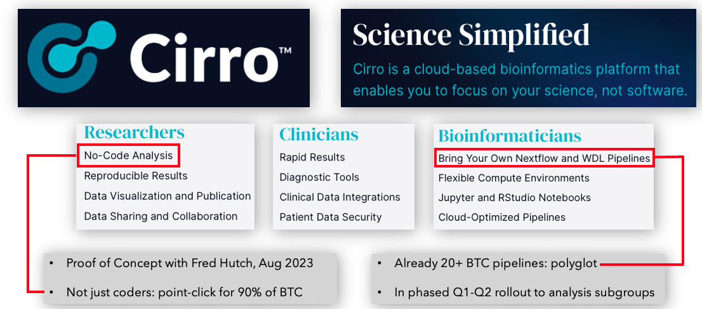

## DASH Release Notes

## **2024_03_04**

Welcome to the inaugural edition of the DASH Release Notes, through which we'll provide regular, BTC-wide updates as new datasets, analysis methods & pipelines, infrastructure, and more emerge.  With this first installment we're happy to relay:

- A meeting of the Data Science TeamLab (DST) last week at MD Anderson, with thanks to Kadir Akdemir & MDA colleagues for hosting.  This 2-day event showcased considerable progress in the development of analysis methods & pipelines (notably single-cell and bulkRNA, TCR, spatial, and classical bulkDNA approaches); and how they're being woven into an increasingly capable data analysis system for the entire BTC portfolio.  Leading to energetic discussion of future science, cross-team interaction, and trainee development.
- Data snapshot version **2024-02-20**, with over 1K samples and 9TB of data across several TeamLabs:
    - OV-IOC:
        - 335 STIC histoPath images from the Shih Lab @ JHU (courtesy of Yen-Wei Chien)
        - Over 200 files of methylation data from the Cope Lab at JHU
    - Pancreatic: over 450 files including
        - Flow, RNASeq, and path images of MRTX1133-treated mice & cell lines from Dougan Lab @ DFCI (courtesy of Li Qiang)
        - Visium spatialTranscriptomics mouse data from Kalluri Lab @ MDA (courtesy of Kate McAndrews)
        - Cell surface proteomics from Oni Lab @ MIT (courtesy of Salome Shubitidze)
    - More than 4,400 files of GBM data comprising 101 samples and 8 assay data types

        _Contact the [DASH team](mailto:dash@breakthroughcancer.org) if you still do not have an account for accessing or analyzing data, but please keep in mind that until embargo periods have passed the data created by a TeamLab will generally be accessible only to members of that TeamLab._

    - Data shared to DASH is summarized for easy perusal in the
	[Board app](https://board.breakthroughcancer.org) ...

    ... may be browsed/downloaded from the [Browse app](https://data.breakthroughcancer.org) or
	programmatically (e.g. see
	<a href="https://cloud.google.com/sdk/gcloud/reference/storage">here</a> or
	<a href="https://cloud.google.com/storage/docs/gsutil">here</a>)
    
    ... analyzed with any of the 20+ pipeline configurations available in [Cirro](https://cirro.bio)
    
    ... with all easily accessed from the DASH home page at
    [dash.breakthroughcancer.org](https://dash.breakthroughcancer.org)
    
