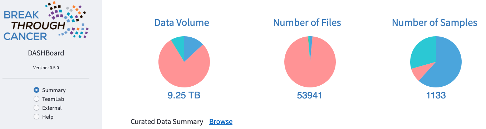

## DASH Release Notes

## **2025_10_24**

Progress in data science across the BTC portfolio in Q3 has been remarkable.  Notably, **recent publications
highlight BTC investigator-led advances in computational analysis,** including:
the [CloneSeq-SV](https://doi.org/10.1038/s41586-025-09580-0) method for tracking clonal evolution using cell-free DNA and single-cell WGS;
the [MorphLink](https://doi.org/10.1038/s41467-025-61142-0) framework for co-analyzing cellular morphology and molecular dynamics in spatial omics;
and a preprint describing the [ProteomeGenerator3](https://doi.org/10.1101/2025.08.23.671943) tool for integrated analysis of long-read transcriptomics and multi-dimensional proteomics.

**Data shared to DASH has swelled to 58 TB, effectively doubling in 9 months** and spanning more than 1100 subjects and 12K samples, including external sources.  This expansion reflects increased harmonization across eight disease TeamLabs and several clinical trials, supporting a growing number of publications and enhancing BTC’s capacity for multi-modal discovery.

**Finally, the DASH platform has also advanced significantly,** with a [faster and more unified portal interface](https://dash.breakthroughcancer.org)

that showcases major enhancements to existing applications and launches several new ones, including:

- **PipeLand** &nbsp;&nbsp; graphically navigate analysis tools by data modality, with point-click pipeline execution in Cirro
- **SCRP**  &nbsp;&nbsp;&nbsp;&nbsp;&nbsp;&nbsp;&nbsp;&nbsp; prototype for cross-institutional exploration of single cell RNAseq datasets per TeamLab
- **WhoDat** &nbsp;&nbsp;&nbsp;&nbsp; easy way to search for BTC collaborators by name, institution, or TeamLab

This update to the DASH ecosystem streamlines end-to-end scientific workflows while exposing a broader and richer set of metadata. **For most datasets, key metrics of accrued data are now visible across BTC** and can also be explored on a per-TeamLab basis in both summary form or more granular, study-specific views.

## **2025_06_30**
As Q2 of 2025 concludes, we’re pleased to report accelerating momentum at the interface of data science and disease-focused translational efforts across the BTC network. Since January, data shared to [DASH](https://dash.breakthroughcancer.org)
has surged 93% to 54 TB, now representing over 800 subjects and 2,100 biospecimens (including external sources).  This growth reflects increased harmonization across 8 TeamLabs and several clinical trials, supports multiple publications, and expands BTC’s capacity for integrated, multi-modal discovery.

A highlight of the quarter was the 2nd Annual BTC Hackathon, hosted June 9–10 by the Beroukhim Lab at the Broad Institute. With 67 registrants spanning 7 TeamLabs, the event sparked wide-ranging technical creativity and seeded multiple ongoing collaborations. The winning team, Hack2Align, exemplified the collaborative BTC 

spirit: drawing on
on the CODA/PIVOT tools originally developed within the DPT TeamLab, four imaging modalities from GBM TeamLab (H&E, Xenium, MALDI, CyCIF/ImF), and analytical expertise from Data Science TeamLab, they developed a prototype workflow for spatial co-registration across imaging modalities. Despite its early-stage nature, the pipeline achieved a surprisingly robust ~40-pixel alignment RMSE and shows potential for enabling more integrated, multimodal analyses across BTC’s spatially resolved datasets.

## **2025_03_27**
Welcome to the first installment of DASH release notes in 2025! The Data Science
Team (DST) closed 2024 with enormous progress and a strong sense of momentum across
BTC, with DASH seeing a
<a href="https://board.breakthroughcancer.org" rel="noopener noreferrer" target="_blank">28X increase in volume of data shared</a>
by TeamLabs, nearly
<a href="https://breakthroughcancer.cirro.bio" rel="noopener noreferrer" target="_blank">200 computational pipelines available in Cirro</a>,
and deeply resourced multimodal analyses underway in numerous TeamLabs&ndash;fueled by novel BTC methods.  In just the first few months
of 2025 the volume of data shared to DASH has grown 42% to over 40TB, reflecting contributions from 8 TeamLabs and notably 
including hundreds of thousands of images from our newest TeamLab, LungRD.
 This is **catalyzing innovative scientific engagement** with disease TeamLabs, including collaborations with:

- **The GBM team**, helping advance interpretation of single cell RNA sequencing (scRNA-seq), DNA sequencing, and both T-cell and malignant cell clonal tracking data from the needle biopsy trial, to gain deeper insights into cancer evolution; and spearheading data deposition for the trial pilot publication
- **The Ovarian MRD team**, to adapt and optimize an approach for longitudinal tracking of drug resistance and co-leading spatial tumor microenvironment profiling to advance our understanding of MRD biology
- **The KRAS team**, to advance understanding of cellular and molecular mechanisms of response and resistance to KRAS inhibitors by analyzing scRNA-seq data from clinical specimens and mouse models
- And contributing to the **evaluation and use of spatial omics platforms** by analyzing and integrating spatial pilot data through the development and application of novel spatial methods.

**Another important milestone in multimodal analytics is the GBM Explorer**. Developed by Alex Ling (Chiocca Lab, BWH), this APP brings together **5 data modalities** (scRNA, TCR, bulkRNA, images, and clinical annotations), enabling clinicians, computational biologists, and engineers to: overlay experimentally measured values on brain 

biopsy locations in 3D; for rapid co-visualization of measured values from different assays; and easy visualization of patient treatment histories.  Thanks to innovative security infrastructure work by Henry Dewhurst at BTC Central, GBM Explorer is the **first multimodal analysis APP developed completely within BTC** for use across all institutions by members of a single TeamLab, and we look forward to re-using this model to deploy BTC-wide portals for scRNA-seq, scTCR-seq, scBCR-seq and spatial 'omics as well as extend the use of [cBioPortal](https://www.cbioportal.org) in BTC.

## **2024_06_03**

In this quarter's installment of the DASH release notes we are happy to again report tremendous progress.

- An **incredibly successful Hackathon event,** with some 50 registrants across 5 TeamLabs coming together
May 20-21 at MSKCC for: 6 training workshops on emerging scRNA, spatial, TCR, and bulkDNA+RNA pipelines
in Cirro, coupled with hands-on data analysis and real-time tool construction to explore scientific hypotheses.
Each of the working groups performed valuable pipeline, analysis, and exploratory data work; with the winning team
taking home a $150 prize for developing a novel approach to using the pool of doublet cells in GBM single-cell
RNA data (about 10% of cell population) as markers for strong cell-cell interaction, confirming one such 
interaction in matched GBM spatial data, then using L-R gene vector analysis to identify a marked 
gradient effect in a separate, public GBM dataset.  Finally, we'd like to thank the MSKCC and BTC organizing,
events, and Program Management teams for tremendous catalyzing effort and helping create the sense that this
inaugural hackathon is but the first of many to come.
- The **scRNA, spatial, and TCR development teams have released multiple versions of their pipelines,** applied 
in conjunction with disease TeamLabs to emerging data.
- By way of 6 internal data releases, the **total quantity of data shared to DASH has more than
doubled since March** and number of files nearly tripled; the current **2024-05-21** data version
includes over 20TB across some 1200 samples:

- Thanks to Henry Dewhurst and the Cirro team (especially Nathan Thorpe), **we now have an operational, BTC-specific
Cirro tenant.** This provides additional security sandboxing and configuration flexibility, was used in the 
aforementioned hackathon, and is the **final major step towards production-grade, multi-modal analyses workspaces
for each disease TeamLab** to be rolled out in Q2 through Q4 of 2024.
- **Multiple software releases of the DASH Board, Browse and Curate APPs**
    - Reflecting new metadata export, annotations, and filtering capabilities
	- Improved UI, phone home, and metadata collection, towards self-service by data coordinators

## **2024_03_04**

Welcome to the inaugural edition of the DASH Release Notes, through which we'll provide regular, BTC-wide updates as new datasets, analysis methods & pipelines, infrastructure, and more emerge.  With this first installment we're happy to relay:

- A meeting of the Data Science TeamLab (DST) last week at MD Anderson, with thanks to Kadir Akdemir & MDA colleagues for hosting.  This 2-day event showcased considerable progress in the development of analysis methods & pipelines (notably single-cell and bulkRNA, TCR, spatial, and classical bulkDNA approaches); and how they're being woven into an increasingly capable data analysis system for the entire BTC portfolio.  Leading to energetic discussion of future science, cross-team interaction, and trainee development.
- Data snapshot version **2024-02-20**, with over 1K samples and 9TB of data across several TeamLabs:
    - OV-IOC:
        - 335 STIC histoPath images from the Shih Lab @ JHU (courtesy of Yen-Wei Chien)
        - Over 200 files of methylation data from the Cope Lab at JHU
    - Pancreatic: over 450 files including
        - Flow, RNASeq, and path images of MRTX1133-treated mice & cell lines from Dougan Lab @ DFCI (courtesy of Li Qiang)
        - Visium spatialTranscriptomics mouse data from Kalluri Lab @ MDA (courtesy of Kate McAndrews)
        - Cell surface proteomics from Oni Lab @ MIT (courtesy of Salome Shubitidze)
    - More than 4,400 files of GBM data comprising 101 samples and 8 assay data types

        _Contact the [DASH team](mailto:dash@breakthroughcancer.org) if you still do not have an account for accessing or analyzing data, but please keep in mind that until embargo periods have passed the data created by a TeamLab will generally be accessible only to members of that TeamLab._

    - Data shared to DASH is summarized for easy perusal in the
	[Board app](https://board.breakthroughcancer.org) ...

    ... may be browsed/downloaded from the [Browse app](https://data.breakthroughcancer.org) or
	programmatically (e.g. see
	<a href="https://cloud.google.com/sdk/gcloud/reference/storage">here</a> or
	<a href="https://cloud.google.com/storage/docs/gsutil">here</a>)
    
    ... analyzed with any of the 20+ pipeline configurations available in [Cirro](https://cirro.bio)
    
    ... with all easily accessed from the DASH home page at
    [dash.breakthroughcancer.org](https://dash.breakthroughcancer.org)
    
